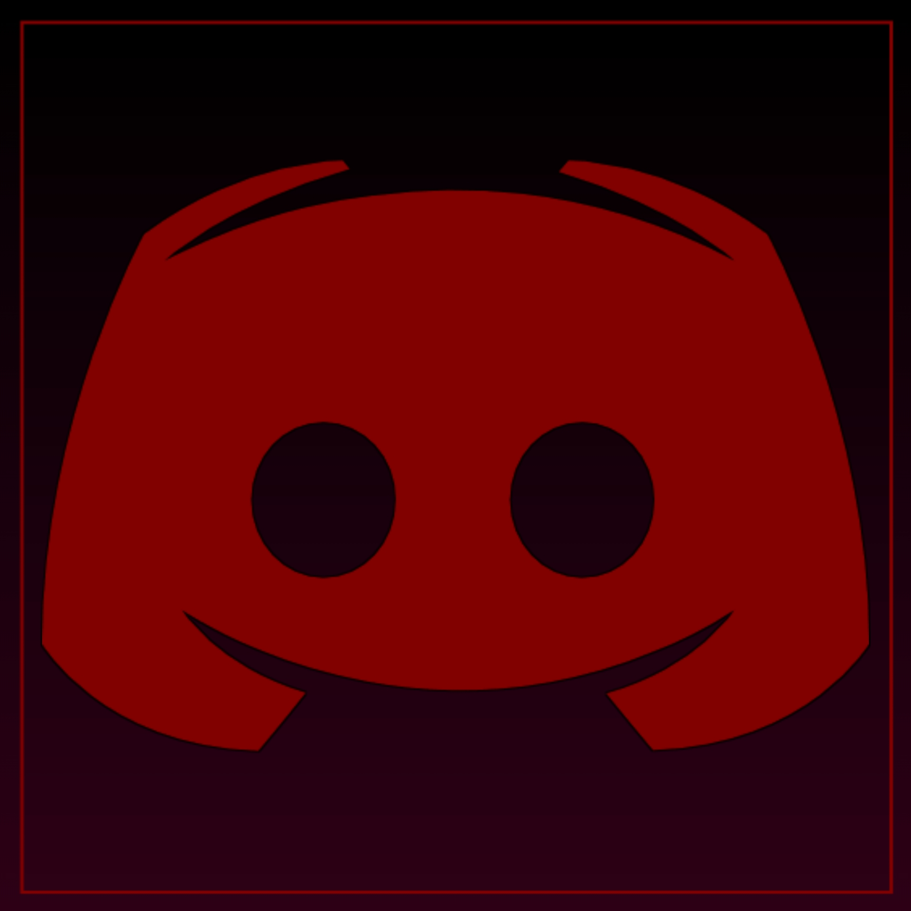

<!-- Main banner -->

<h1 align="center">Make dreams come true</h1>

&nbsp;Lorem ipsum dolor sit amet consectetur adipisicing elit. Nemo ea unde amet totam dolorum harum fugiat, sit optio dolores, magnam, quidem natus provident nihil distinctio aspernatur ut officia! Deleniti, quos.
Iusto corrupti nesciunt doloremque quasi beatae, sit sunt illo nobis tempora excepturi obcaecati quia cumque voluptas nemo possimus exercitationem, culpa voluptates ab quae! Harum similique odio dolorem nam autem laboriosam.
Iusto tenetur adipisci magnam accusantium officia, ipsam ea quis aperiam libero at? Voluptatibus vero aliquam nulla ex cum, alias necessitatibus omnis ea iste praesentium, nesciunt iure? Iste aliquam modi unde?

<!--- Social buttons --->
<h2 align="center">Connect with me</h2>

  
  

- 👋 Hi, I’m @GTPSHAX
- 👀 I’m interested in Web Development
- 🌱 I’m currently learning HTML and CSS

<!---
GTPSHAX/GTPSHAX is a ✨ special ✨ repository because its `README.md` (this file) appears on your GitHub profile.
You can click the Preview link to take a look at your changes.
--->
